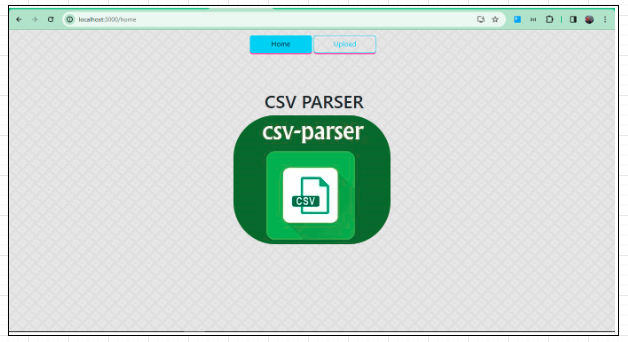
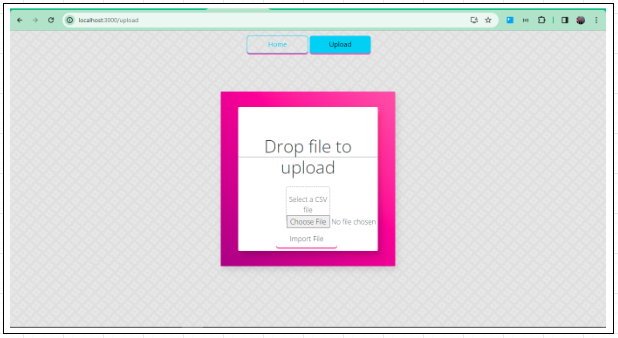
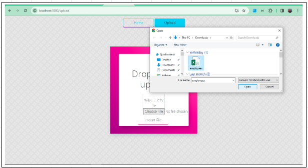
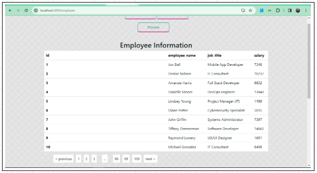
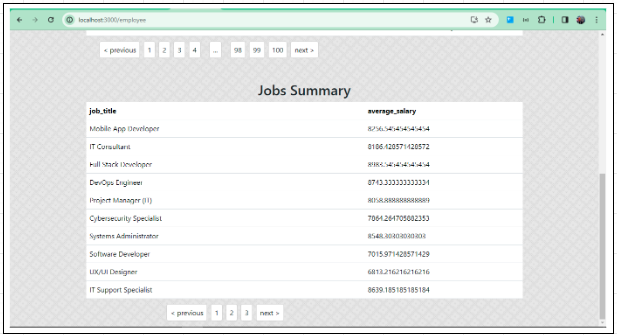
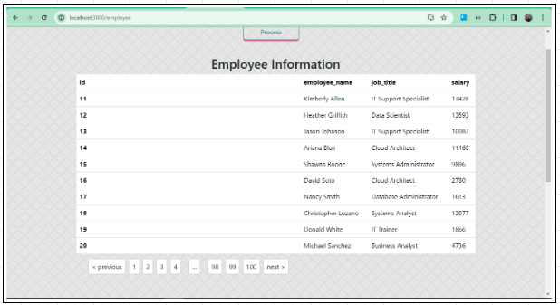

# DNA Engineering Full-Stack Assignment - CSV Parser

## Project Overview

This project is a full-stack application for DNA Engineering, specifically focusing on CSV parsing functionality. The application provides a user-friendly interface for uploading and parsing CSV files, along with an employee page to display the parsed data.

## Screenshots

### Home Page
!

### Upload Page

### Employee Page

